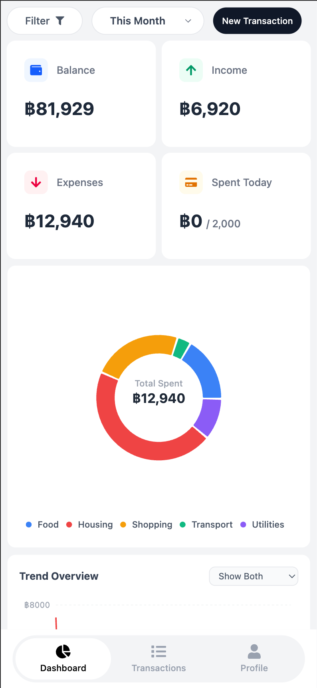
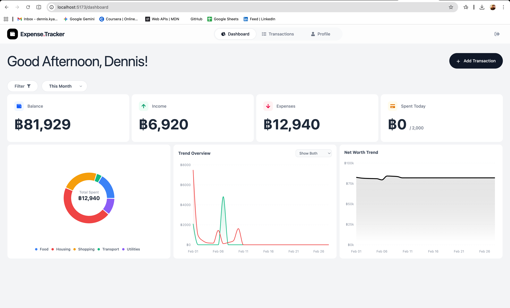
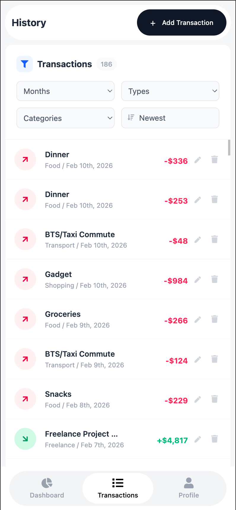
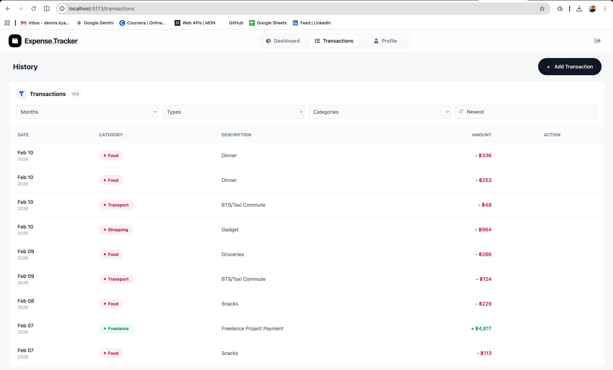
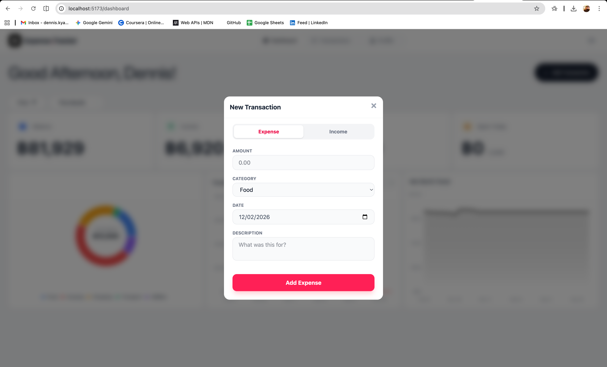
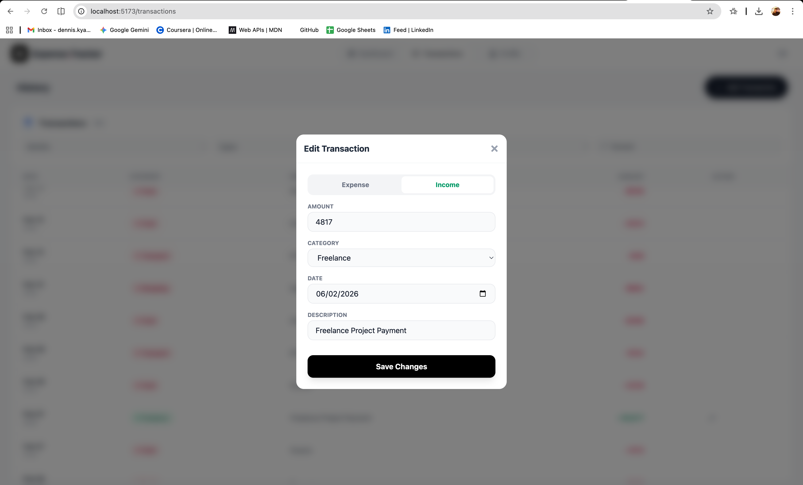

# Expense.Tracker 💰


## Overview

**ExpenseTracker** is a full-stack financial management application designed to help users track income, expenses, and daily spending limits. Built with the **MERN Stack** (MongoDB, Express, React, Node.js), it features a secure authentication system, real-time data visualization, and a responsive design that adapts its layout specifically for mobile vs. desktop workflows.

The project emphasizes **data integrity**, **security best practices** (PIN hashing, session timeouts), and **User Experience** (modal-based editing, instant UI updates).

---

## Screenshots

_(Place your screenshots in a /screenshots folder)_

|                            **Mobile View (List)**                            |                         **Desktop View (Table)**                          |
| :--------------------------------------------------------------------------: | :-----------------------------------------------------------------------: |
|  |  |

|                           **Transaction PC Summary**                            |                        **Transaction Mobile Summary**                        |
| :-----------------------------------------------------------------------------: | :--------------------------------------------------------------------------: |
|  |  |

|                      **Adding Transaction on PC**                       |                      **Editing Transactions on PC**                       |
| :---------------------------------------------------------------------: | :-----------------------------------------------------------------------: |
|  |  |

---

## Tech Stack

### **Frontend**

- **React.js (Vite):** Component-based UI architecture.
- **Tailwind CSS:** Utility-first styling for responsive design.
- **Axios:** HTTP client with interceptors for global error handling.
- **Date-fns:** robust date manipulation and formatting.
- **React Icons:** Visual indicators for UI elements.
- **Recharts:** Charting and data visualization.

### **Backend**

- **Node.js & Express:** RESTful API architecture.
- **MongoDB & Mongoose:** NoSQL database for flexible data modeling.
- **Bcrypt.js:** Security hashing for User PINs.
- **Cors & Dotenv:** Middleware for security and environment configuration.

---

## Key Features

### **1. Transaction Management**

- **CRUD Operations:** Users can Create, Read, Update, and Delete transactions seamlessly.
- **Advanced Filtering:** Filter data by **Month**, **Type** (Income/Expense), and **Category**.
- **Sorting:** dynamic sorting by Date and Amount.
- **Editing:** Modal-based editing system that pre-fills existing data for quick updates.

### **2. Dashboard & Analytics**

- **Real-time Summary:** Calculates Total Income, Total Expense, and Current Balance on the fly.
- **Daily Spending Logic:** Tracks expenses specifically for the current day (based on Bangkok timezone logic) against a user-defined limit.

### **3. Responsive UX Design**

- **Adaptive Layouts:**
  - _Mobile:_ Renders a card-based list view with large touch targets and simplified actions.
  - _Desktop:_ Renders a detailed data table with hover effects and dense information display.
- **Interactive Feedback:** Loading states, success alerts, and confirmation modals for destructive actions (Delete).

### **4. Security & Authentication**

- **PIN Authentication:** Users register/login using a numeric PIN which is hashed before storage.
- **Session Management:**
  - **Auto-Logout (Inactivity):** Frontend listener logs users out after 30 minutes of inactivity.
  - **Token Expiry Handling:** Axios interceptors catch `401 Unauthorized` errors and force a redirect to login.

---

## System Architecture

### **Database Schema**

- **User:** Stores profile info, hashed PIN, and financial settings (Initial Balance, Daily Limit).
- **Transaction:** Linked to `User` via ObjectId. Stores amount, type, category, date, and description. Indexed by `user` and `date` for performance.

### **API Structure**

The backend follows a RESTful pattern:

- `/api/auth`: Handles registration and login.
- `/api/transactions`: Handles all CRUD operations for financial records.
- `/api/users`: Handles profile updates (Name, Limits, Balance).

---

## Getting Started

### **Deployment**

Frontend Depooyment : **Vercel**
WebApp Link : <a href="https://expense-tracker-zeta-eosin-16.vercel.app"> Expense.Tracker </a>

Backend Depooyment : **Render** (Due to free plan restrictions, it may take about 50 seconds for api response when you first log in)

Follow these instructions to set up the project locally.

### **Prerequisites**

- Node.js (v14+)
- MongoDB (Local or Atlas URL)

### **1. Clone the Repository**

```bash
git clone [https://github.com/yourusername/expense-tracker.git](https://github.com/yourusername/expense-tracker.git)`
cd expense-tracker

```

```bash

# **FRONTEND SETUP**

cd client
npm install

# Create .env file
echo "VITE_API_URL=http://localhost:5001/api" > .env

# Start Client
npm run dev

```

```bash

# **BACKEND SETUP**

cd server
npm install

# Create .env file
echo "MONGO_URI=your_mongodb_connection_string" > .env
echo "PORT=5001" >> .env
echo "JWT_SECRET=your_secret_key" >> .env

# Start Server
npm start

```

The app should now be running at <a href=http://localhost:5173> http://localhost:5173 </a>

| Method     | Endpoint                            | Description                                         |
| :--------- | :---------------------------------- | :-------------------------------------------------- |
| **POST**   | `/api/auth/register`                | Register a new user with PIN and initial balance.   |
| **POST**   | `/api/auth/login`                   | Authenticate user and receive access token.         |
| **GET**    | `/api/transactions/:userId`         | Retrieve full transaction history for a user.       |
| **GET**    | `/api/transactions/summary/:userId` | Get dashboard stats (Balance, Totals, Daily Limit). |
| **POST**   | `/api/transactions`                 | Create a new income or expense record.              |
| **PUT**    | `/api/transactions/:id`             | Update an existing transaction's details.           |
| **DELETE** | `/api/transactions/:id`             | Permanently remove a transaction.                   |
| **PUT**    | `/api/users/:id`                    | Update user profile, limits, or initial balance.    |

### **Future Improvements**

Data Visualization: Add more charts using Recharts for visual expense breakdown.

Export: Ability to export transaction history to CSV/PDF.

Recurring Transactions: Logic to handle subscriptions automatically.

Written by: **Kyaw Swar Hein**
